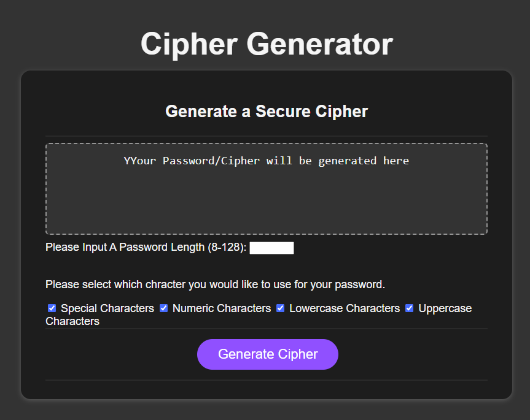

# Cipher Creator

## Description
A cipher generator that creates a password consisting of 8 upto 128 alphanumeric &amp; special characters, depending on the users choice.
 
 
Cleaned up the code structure for better readability and maintainability.
I refactored arrays for special characters, numeric characters, lowercase characters, and uppercase characters for clarity and created an options object to hold these character arrays.
 
 
Refactored the password generation logic to make it more user-friendly.then I hanged the method of getting password options to allow for a clearer understanding.
Having alerts and logs messages if the user inputs are not valid.
 
 
Integrated a dark mode toggle button without creating a separate page for user preference, and added styles for a more aesthetic appearance.

## Application Image
 

 
 

## Application URLs
 
 

## Author
Darren Buck
https://github.com/ParboldCoder
